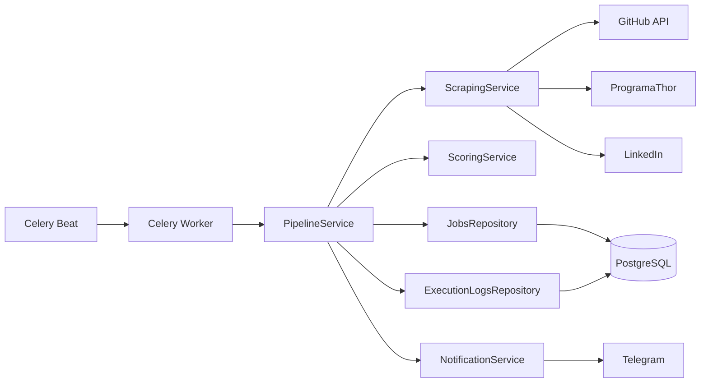

# Architecture

JobHunter is organized around a small Celery entrypoint and a service-oriented application core.

The Celery task only calls `PipelineService.run()`. Scrapers return normalized Pydantic `Job` objects. Services enrich and score jobs. Repositories own persistence and Alembic owns schema evolution.
